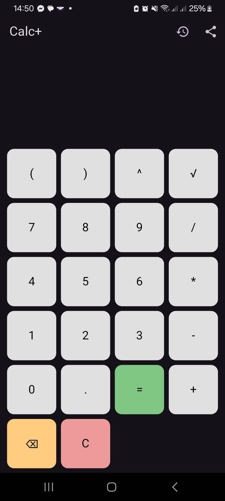
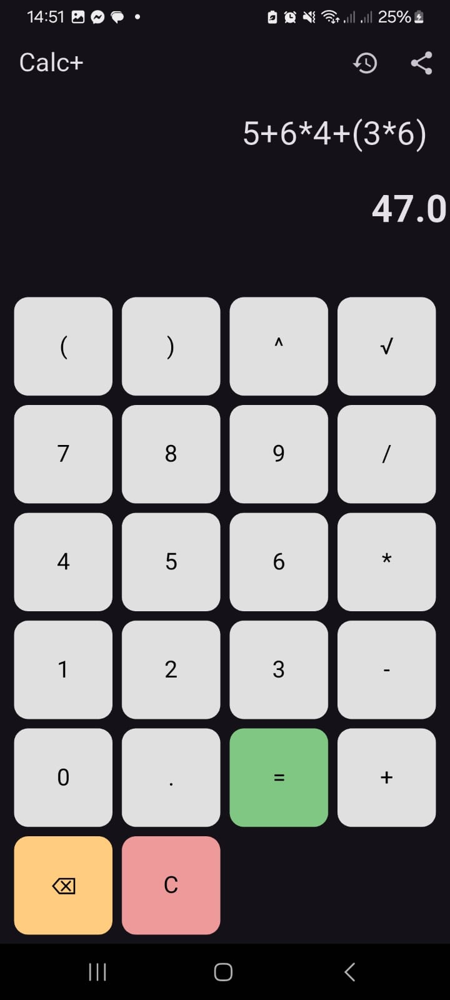
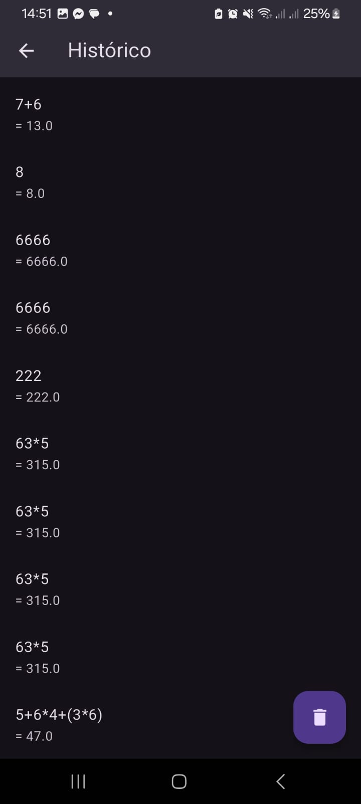

# 📱 Calc Plus

Uma calculadora moderna com histórico de operações usando Hive e layout responsivo com Flutter.

## ✨ Funcionalidades

- Cálculo de expressões com `+`, `-`, `×`, `÷`, `√`, `()`.
- Histórico salvo localmente com Hive.
- Design responsivo.
- Armazenamento e recuperação de operações.

## 📸 Screenshots

| Tela principal                    | Expressao                      | Resultado                      | Histórico                      |
|-----------------------------------|--------------------------------|--------------------------------|--------------------------------|
|  |  |  |  |

## 🚀 Tecnologias

- Flutter
- Hive
- Dart

## 📦 Como rodar

## 📁 Estrutura do projeto
- lib/views: Telas da calculadora e histórico.
- lib/models: Modelo Calculation.
- lib/controllers: Lógica de Hive e avaliação.

## 🧠 Autor
- Joel Nascimento

```bash
flutter pub get
flutter run

